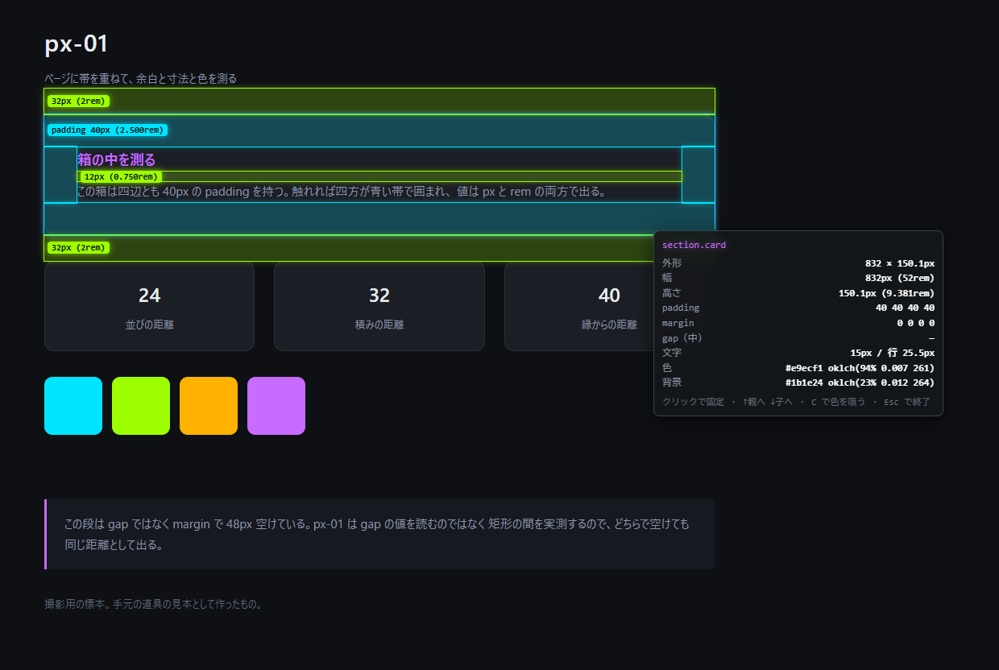
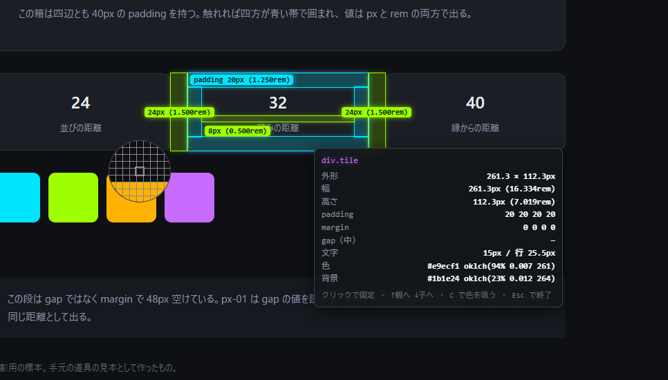
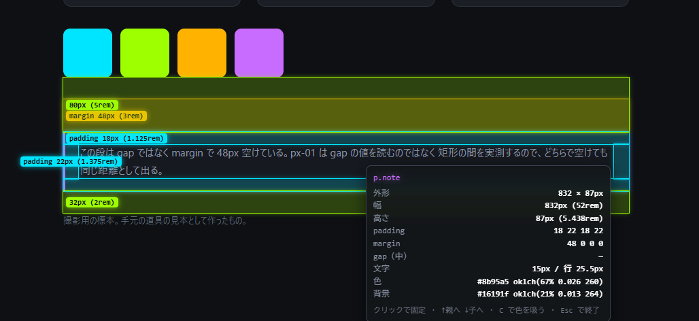

# px-01

ページに帯を重ねて、**余白と寸法と色**を測る Chrome 拡張（MV3）。

触れている要素の padding・margin と、隣り合うもの同士に空いている距離を色帯で敷き、
外形・文字・色を **px と rem の併記**、色は **hex と oklch の併記**で出す。



## 使い方

1. `pnpm install && pnpm build` で `dist/` を作る
2. `chrome://extensions` を開き、**デベロッパーモード**を入れて「パッケージ化されていない拡張機能を読み込む」で `dist/` を選ぶ
3. 測りたいページでツールバーのアイコンを押す（または `Alt+Shift+P`）

| 操作 | すること |
|---|---|
| マウスを動かす | 触れているものを測る |
| クリック | その場に固定（もう一度で解除）。ページのリンクは踏まない |
| `↑` / `↓` | 親へ登る / 子へ降りる（登った道を覚えていて、同じ道を戻る） |
| `C` | 画面の1点から色を吸ってクリップボードへ（`EyeDropper`） |
| `Esc` | 終了。ホストごと消えて、ページは元通り |

立ち上げている間、この4つの打鍵はこちらが受け取る——**入力欄に焦点があっても文字は入らず**、
ページ側の仕掛けも鳴らない（コメント欄に `c` が落ちる、の類い）。
ただし**修飾つき（`Ctrl+C` など）と IME の変換中は見送る**。ブラウザの手癖と日本語入力まで奪うと、
道具を開いている間だけ別のページを触っているように感じる。

なおページ自身が window の捕捉段に先んじて聞いている打鍵は、こちらより先に届く（後から流し込む以上、
順番は覆せない）。文字が入るのを止めるところまでは、どの場合も効く。

DevTools のデバイス表示（タッチの真似）では、**押していない間はカーソルの動きが一切届かない**
（pointermove も mousemove も鳴らない。実測）。辿るには **押しながら滑らせる**か、
Device type を `Mobile (no touch)` にしてカーソルの動きを戻す。

拡大しているときは、パネルと札だけ逆数で縮める。度合いは**立ち上げた時点の画素比との比**で見るので、
先に拡大してから起動すると、その倍率が基準になる——`Esc` で閉じて開き直せば取り直す。



## 帯の色

暗い画面に映えるネオン。色相を四方へ散らし、隣り合っても取り違えないようにしてある。

| 色 | 何 |
|---|---|
| バイオレット | 触れているものの外形（border box）。パネルの見出しも同じ色 |
| シアン | padding |
| アンバー | margin |
| ライム | 隣り合うもの同士に空いている距離（gap でも margin でも、実際の空きを測る） |

滲みは 7px に留める。強くすると帯の境目がぼやけ、測る道具としての線が読めなくなる。
数値の行は白のまま——全部を光らせると、どれが要点か分からなくなる。



札は画面の中へ押し戻し、札同士とパネルを避けて置く。避けきれないものは出さない。
同じ文言を省くのは**その要素自身の四辺だけ**——隙間は同じ値でも全部名乗る
（省くと、同じ間隔が並ぶ場所で無言の帯だけが残る）。

## 開発

```
pnpm watch     焼き直し + 刻印の配布（127.0.0.1:3401）
pnpm build     dist/ を作る（見張りは入らない）
pnpm typecheck
pnpm sample    撮影と確かめ用の標本を配る（localhost:3500）
```

`sample/` は測られるためだけに作った静かなページ。padding 40px・並び 24px・積み 32px・
margin で空けた 48px と、値を丸い数に揃えてあるので、撮った画像の中でも読める。

`pnpm watch` の間は、常駐が 1.5 秒ごとに刻印を見張り、**変わったら自分で拡張を入れ替える**。
`chrome://extensions` の再読み込みを押さずに済むが、**見張りを持つ版に入れ替わるまでの一度だけ**は手で押す。

## 作りの決めごと

- **ページの既存ノードには何も書き込まない**（属性も class も style も）。描くものは自前のホスト1枚に閉じ、
  Shadow DOM の中だけで完結させる。ColorZilla の類いが `<body>` へ属性を足し、
  Next.js の hydration を壊す事故を踏まないため
- 流し込むのは**アイコンを押されたときだけ**（`activeTab` ＋ `scripting`）。押されるまでどのページにも触れない
- **隙間は gap の値ではなく矩形の間を実測する**。margin でも space-between でも、目に見えている空きが出る
- **札の寸法は DOM へ入れてから測る**。入れる前は `offsetWidth` が 0 を返し、画面内へ押し戻す計算が
  すべて 0 を相手にする（これを違えて札が端へ飛び、重なっていた）
- **UI フレームワークを使わない**。指が動くたびに帯の座標を書き換える仕事なので、差分照合の層は仕事を増やすだけ
- 束ねるのは **esbuild** のみ。`manifest.json` は手書き
- ビルド script だけ素の JavaScript。入口は動く環境をできるだけ狭めない（`.ts` は Node 22.6 以降を要求する）
- `measure.ts` は `chrome.*` を使わない。ゆえに DevTools のコンソールに貼っても同じように動く

